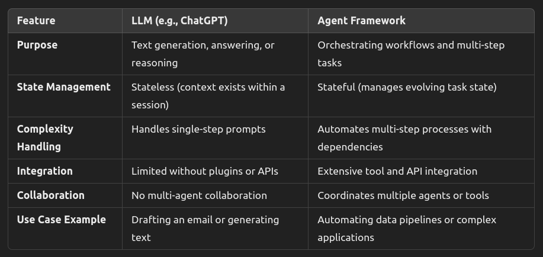
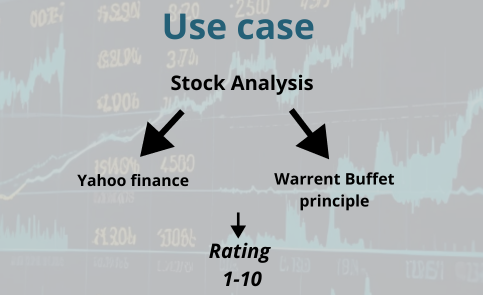
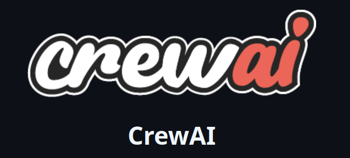
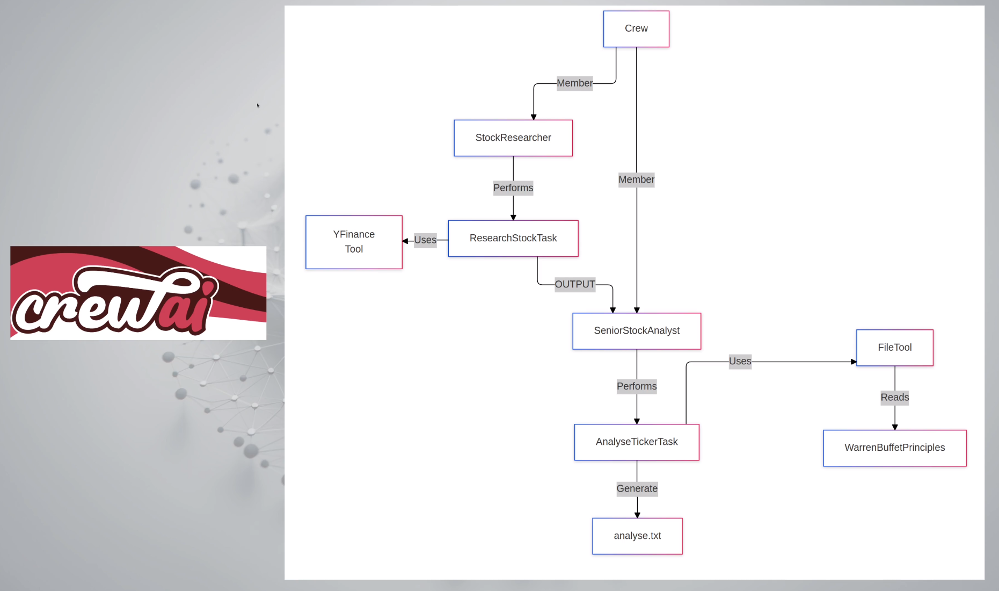
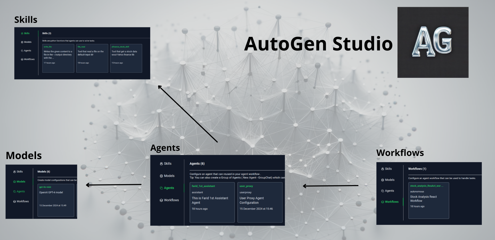
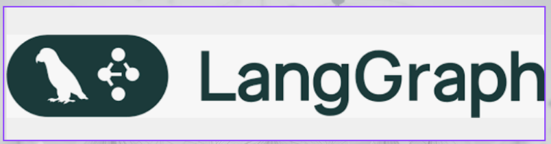
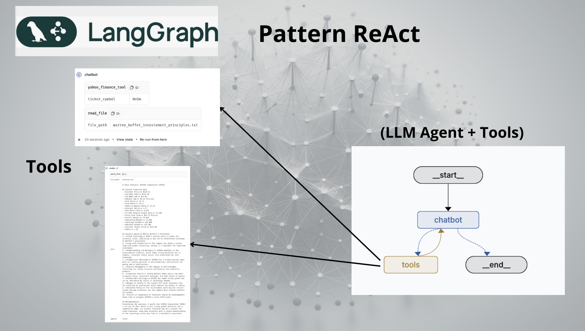
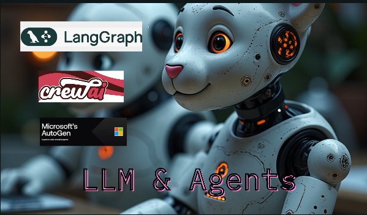

# A short comparison of popular Agent Frameworks

 

## Understanding the rise of Agent Frameworks in 2025

The next wave of AI is agentic, a sweeping tide reshaping the shores of technology and human interaction. Like a powerful current, it pulls everything in its path, transforming how we make decisions, solve problems, and navigate our lives. Dive with me into these waters as we explore three powerful currents - CrewAI's orchestrated flow, AutoGen's interweaving streams, and LangGraph's precise tidal patterns - each carving unique channels in the ever-evolving seascape of artificial intelligence.

## Why Agent Frameworks matter

 As artificial intelligence continues to transform industries, **agent frameworks** are emerging as a game-changer in **2025**.

Key advantages include:

## Comparison: Agent Framework vs. Large Language Model (LLM)

### **1. Large Language Model (LLM)**

#### **Definition**  
A **Large Language Model** (like ChatGPT) is a pre-trained neural network that processes and generates human-like text. It uses large datasets to understand language patterns and context.

### **Core Characteristics**:
- **Primary Function**: Processes and generates text based on input prompts.
- **Stateless**: Each interaction is independent unless explicitly extended with tools like memory.
- **General Purpose**: Handles a wide variety of tasks (e.g., answering questions, summarization, writing code) but relies on prompts for task-specific behavior.
- **Does Not Manage Workflows**: Operates on single-turn inputs without built-in orchestration or automation of complex workflows.
- **Example**: ChatGPT or GPT-4 by OpenAI.

---

### **2. Agent Framework**

#### **Definition**  
An **Agent Framework** is a system or library designed to orchestrate **multiple agents**, including LLMs, APIs, or custom logic, for performing **complex, multi-step tasks** in an automated and collaborative manner.

#### **Core Characteristics**:
- **Workflow Management**: Automates workflows involving multiple steps, tools, or agents.
- **Stateful**: Tracks the state of tasks across multiple interactions, maintaining context continuity.
- **Integration**: Combines LLMs with external tools (e.g., databases, APIs, cloud services).
- **Customizable**: Tailored to specific use cases like code automation, data analysis, or customer support.
- **Collaborative Agents**: Enables communication and coordination between multiple agents (e.g., human-in-the-loop systems, multi-agent collaboration).
- **Example**: LangGraph, AutoGen, LangChain.

---

### **Key Differences**

---

### **Analogy**

Think of an **LLM like ChatGPT** as a highly skilled worker that can handle individual tasks on demand but needs explicit instructions every time.  
An **Agent Framework**, on the other hand, is like a **project manager** that oversees multiple workers (LLMs, APIs, tools), ensuring they collaborate effectively to complete a complex project.

---

### **Use Cases**
- **LLM**: Quick text generation, idea brainstorming, or Q&A sessions.
- **Agent Framework**: Automating customer service processes, orchestrating data pipelines, creating autonomous coding assistants, or managing multi-agent systems.

- **Business Operations**: [Reuters: Autonomous agents and profitability to dominate AI agenda in 2025, executives forecast](https://www.reuters.com/technology/artificial-intelligence/autonomous-agents-profitability-dominate-ai-agenda-2025-executives-forecast-2024-12-12/)
- **Productivity Tools**: AI assistants capable of reasoning are expected to become mainstream, transforming daily workflows. [Financial Times](https://www.ft.com/content/30677465-33bb-4f74-a8e6-239980091f7a)

## A comparative analysis of leading Frameworks

This article provides a short comparison of three prominent agent frameworks:
 - **Autogen**
 - **CrewAI**
 - **LangGraph**
 
These frameworks were chosen for their growing popularity on GitHub, open-source accessibility, and robust feature sets, which make them standout choices for developers and researchers alike. 

By exploring their capabilities, this comparison aims to equip readers with the knowledge needed to navigate the agent framework landscape.

## Comparison criteria

When selecting agent frameworks, clear evaluation criteria become your compass for navigating the complex landscape of AI solutions. These criteria encompass core aspects: technical capability, scalability potential, and development experience. By carefully weighing how CrewAI, AutoGen, and LangGraph perform across these dimensions, teams can better align their choice with project requirements while ensuring sustainable development paths. This methodical assessment helps cut through the complexity, leading to more confident and successful implementations.

### 1. Ease of Use
- Refers to how intuitive and user-friendly the framework is for developers.
- Includes aspects such as clear documentation, straightforward APIs, and community support.

### 2. Performance
- Focuses on the framework’s ability to handle tasks efficiently.
- Includes metrics like execution speed, resource optimization, and scalability.

### 3. Deployment Capabilities
- Evaluates the framework’s flexibility to be deployed across various environments.
- Includes support for platforms like cloud services and on-premises systems.

### 4. User Interface
- Assesses the tools available for managing, monitoring, and debugging agents.
- Includes features like visual workflows, logging systems, and dashboards.

## Use case

To ensure a fair evaluation, we will implement the same use case across all three frameworks. 

This approach allows us to directly compare their capabilities, development patterns, and performance while solving identical requirements. By maintaining consistent testing conditions, we can effectively highlight each framework's strengths and limitations.

#### Objective
To provide a **rating (1-10)** for a stock by combining:
1. **Yahoo Finance data**: Quantitative financial metrics.
2. **Warren Buffett's investment principles**: Qualitative evaluation for long-term value investing.

#### Workflow
1. **Data Collection**:
   - Gather financial data from Yahoo Finance.
   - Apply Buffett's principles to evaluate qualitative aspects.

2. **Analysis**:
   - Combine **quantitative metrics** (Yahoo Finance data) with **qualitative insights** (Buffett principles).
   - Assign weights to each factor (e.g., 50% financial metrics, 50% Buffett criteria).

3. **Scoring**:
   - Develop a formula to compute a final score (1-10).
     - **1**: Poor investment.
     - **10**: Excellent investment opportunity.

4. **Output**:
   - Present the **rating (1-10)** as a simplified indicator for investment decisions into a markdown report.

## Agent Frameworks overview

### CrewAI

[CrewAI](https://www.crewai.com/) is a popular open source Agent framework, with more than 23k ⭐ on [gitHub](https://github.com/crewAIInc/crewAI): 

- Based on **LangGraph**  
- Released in **2024**  
- Raised **$18M** in funding
- Features **role-based** agents

#### Key Features of CrewAI

**1. Agent orchestration**
- CrewAI facilitates seamless collaboration among multiple agents by assigning specific roles and objectives.
- This structured approach ensures efficient and organized interactions between agents.

**2. Integration with tools**
- Agents can integrate and utilize external tools such as **Yahoo Finance** and **file readers**.
- These integrations enable agents to perform more complex and context-aware tasks effectively.

**3. Memory management**
- Agents retain memory of their interactions, enhancing consistency and improving task execution over time.
- Memory capabilities allow for continuity in multi-step processes or recurring tasks.

**4. Task delegation**
- Tasks can be delegated among agents, optimizing workload distribution.
- This feature ensures faster and more efficient completion of intricate workflows.

---

**Use case diagram**

**Evaluation**

- **Ease of Use**: ⭐⭐⭐⭐ It offers clear visibility of agent concepts and connections even for non-developers.
- **Performance**: ⭐⭐ Lacks tools for specific tasks causing issues like hallucinations in LLMs.
- **Deployment**: ⭐ Limited to non-secure environments as it doesn’t allow code execution in a secure Docker container.
- **User Interface**: ⭐ No widely recognized graphical interface available, limiting design and prototyping capabilities.

---

### Autogen

[AutoGen](https://microsoft.github.io/autogen/0.2/) is a popular open source Agent framework backed by Microsoft, with more than 36k ⭐ on [gitHub](https://github.com/microsoft/autogen): 

- Based on the research of [Dr. Chi Wang](https://www.microsoft.com/en-us/research/people/chiw/) at Microsoft and [Dr. Qingyun Wu](https://qingyun-wu.github.io/) at Penn State University
- Recently forked into two branches: **version 0.2** and **version 0.4**
- Support **Python** and **.Net** languages

### Key Features of AutoGen

**1. Multi-Agent Collaboration**  
- AutoGen enables the creation of agent networks where agents collaborate or operate independently.  
- This design supports workflows ranging from fully autonomous systems to those requiring human oversight.

**2. Code Automation**  
- Agents can generate, execute, and debug code automatically, streamlining software development and data analysis tasks.  
- This reduces human intervention and accelerates project timelines.

**3. Integration with Tools and APIs**  
- AutoGen supports integration with external tools and APIs, such as Azure services and databases.  
- This capability expands agent functionality for diverse applications.

**4. Human-in-the-Loop Problem Solving**  
- Agents can request human input for critical decisions, ensuring thoughtful oversight when needed.  
- This feature is ideal for balancing automation with human expertise.

----

**Use case diagram**

**Evaluation**
- **Ease of Use**: ⭐⭐⭐ Although it remains a developer-focused tool, it uses simple design patterns for implementation. 
- **Performance**: ⭐⭐⭐⭐ Best among the three, as it automatically generates necessary code for various tasks and offers a secure execution environment. 
- **Deployment**: ⭐⭐⭐ Provides versatile deployment options including local, cloud, and Docker environments.
- **User Interface**: ⭐⭐⭐ Autogen Studio is the available interface, which despite some bugs, is relatively helpful for workflow design.

----

### **LangGraph Framework**

[LangGraph](https://www.langchain.com/langgraph) is an open-source orchestration framework designed for building stateful, multi-agent applications with Large Language Models (LLMs). It offers enhanced control over agent workflows, enabling the development of complex, reliable, and fault-tolerant AI systems. It has more than 7k ⭐ on [gitHub](https://github.com/langchain-ai/langgraph): 

- Based on the popular [LanChain LLM framework](https://www.microsoft.com/en-us/research/people/chiw/) 

### Key Features of LangGraph

**1. Stateful Orchestration** 
 - Manages shared state across nodes, facilitating complex workflows with cycles and branches.

**2. Persistence** 
- Automatically saves state after each step, allowing for error recovery, human-in-the-loop interactions, and workflow resumption.

**3. Human-in-the-Loop Support** 
- Enables interruption of graph execution for human review, approval, or editing of the agent's planned actions.

**4. Streaming Support** 
- Provides real-time output streaming from each node, enhancing interactive applications.

**5. Integration with LangChain**
- Seamlessly integrates with LangChain and LangSmith, though it can operate independently.

---

**Use case diagram**

**Evaluation**
- **Ease of Use**: ⭐ Rated the least user-friendly. However, after initial setup, it proves effective despite its complexity and developer-centric design.
- **Performance**: ⭐⭐⭐ For providing numerous customization options through its low-level control.
- **Deployment**: ⭐⭐⭐⭐ Extremely versatile with high scores for production capabilities; multiple deployment methods are available.
- **User Interface**: ⭐⭐ Lacks a proper design interface but allows debugging and visualizing workflows.

## Key differences

The analysis reveals several important differences between the agents:
- **CrewAI** is good for non-developers but has performance limitations.
- **Autogen** excels in generating code and ease of securing data execution.
- **LangGraph** offers greater customization and control, making it ideal for developer-heavy teams.

## Applications and Use Cases

Understanding where each framework excels:
- **CrewAI** is suitable for simple agent tasks with less critical performance.
- **Autogen** is favored for rapid prototyping and deployment in various environments.
- **LangGraph** fits projects that require detailed control and customization, appealing to experienced development teams.

## Conclusion

Selecting the right agent framework depends heavily on your specific needs and team capabilities. 

The insights gathered from the video provide a great foundation for understanding the complexities involved in choosing the right agent technology.

For further insights, watch the video: 

 - [2 - LangGraph](insert_video_link)
 - [3 - AutoGen](insert_video_link)
 - [4 - Final comparison](insert_video_link)

Access the full code on [GitHub](https://github.com/fbellame/agent-comparison/tree/master/stock-analysis)

## More about me

